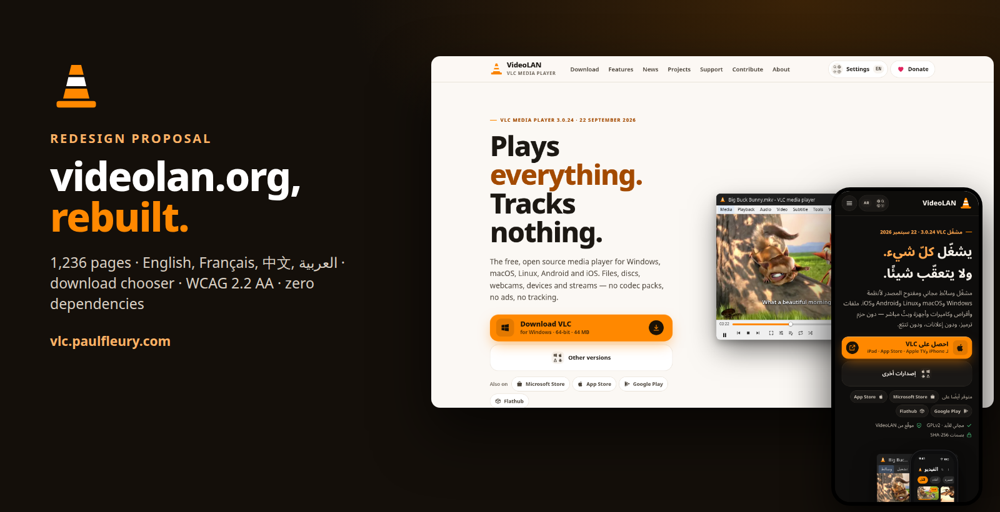
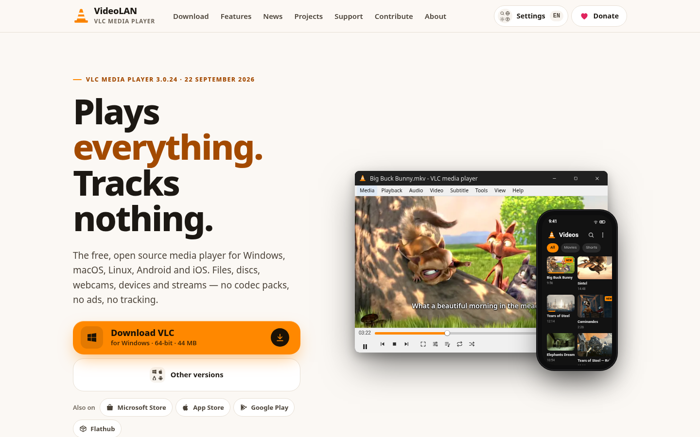
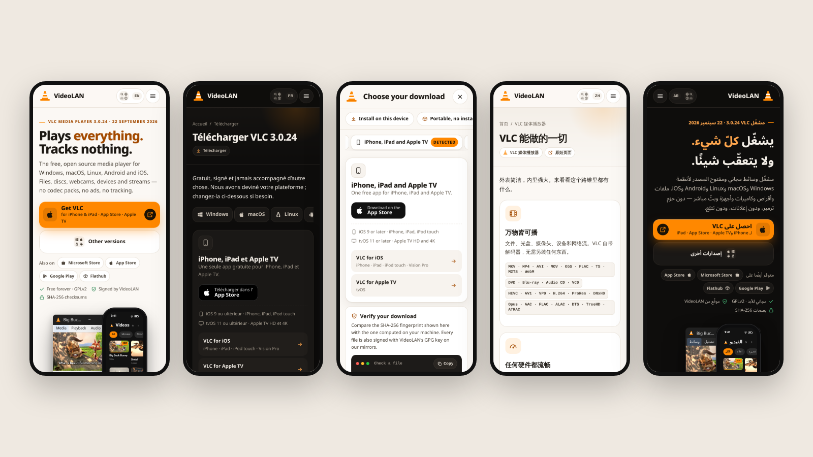
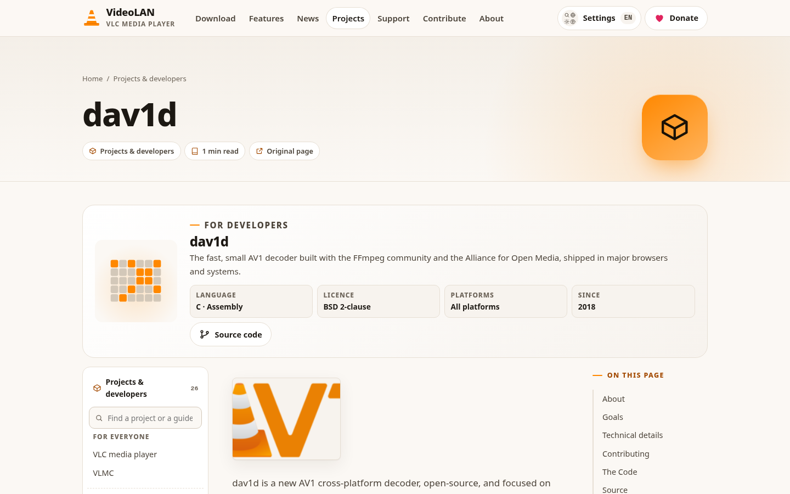
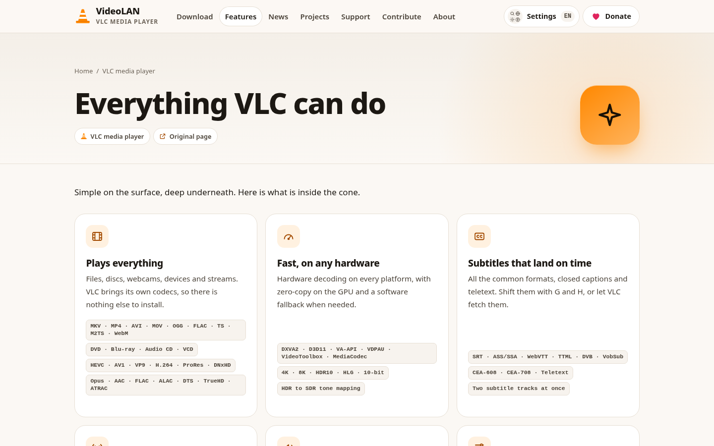
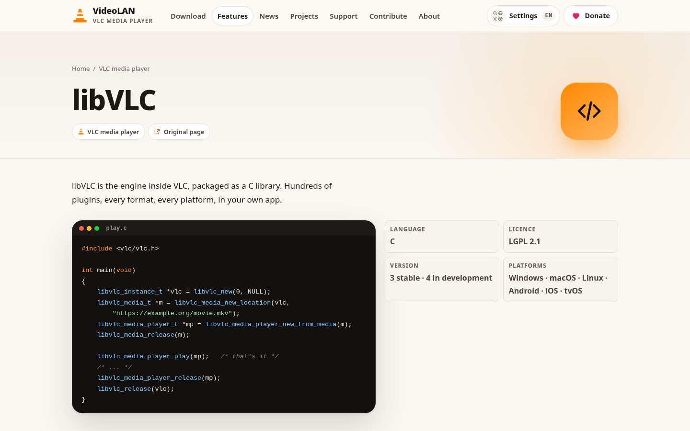
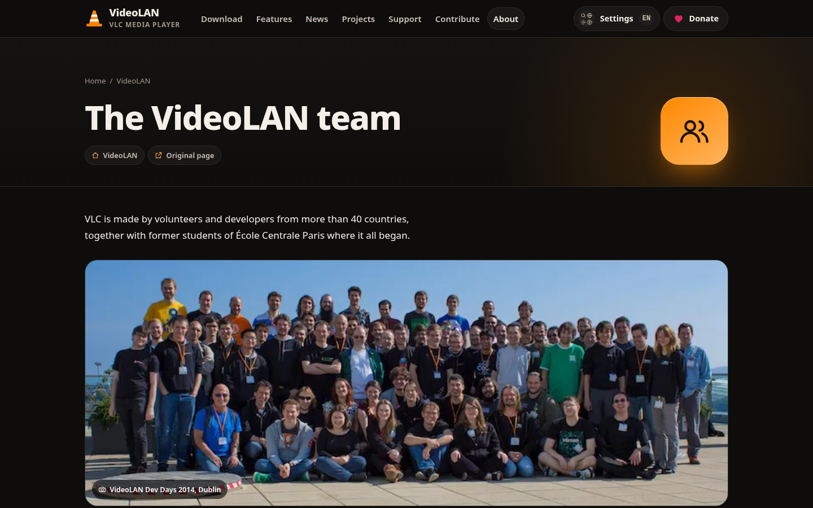
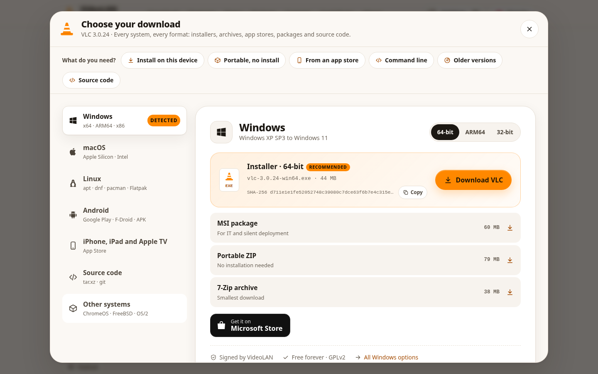
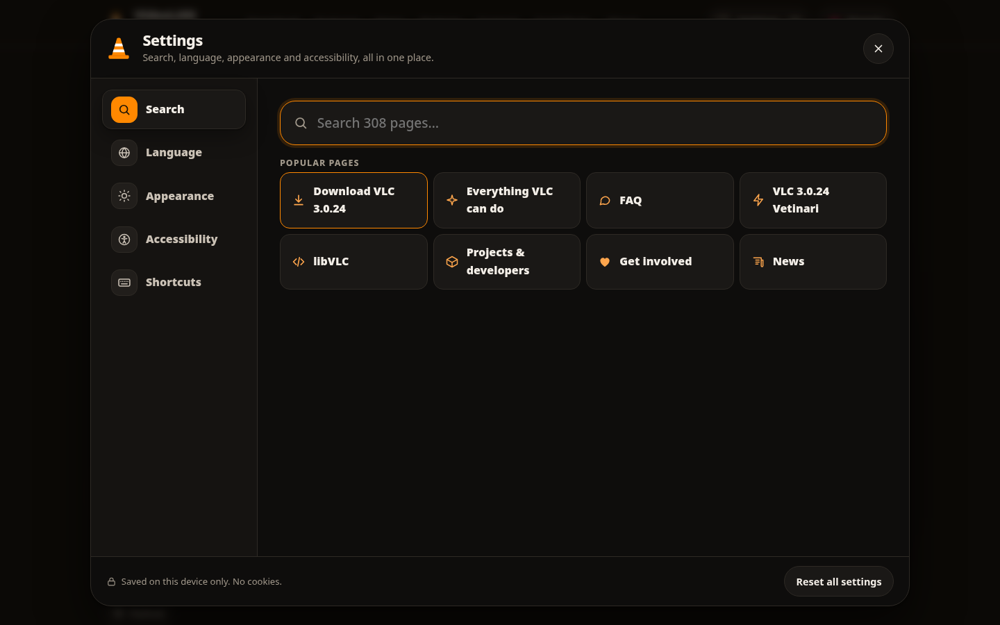
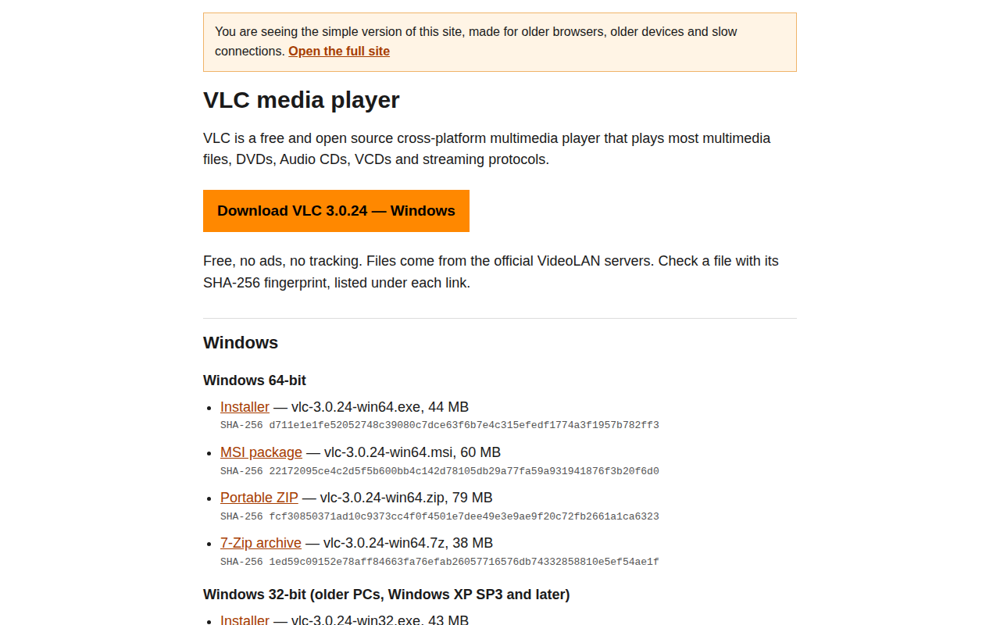

<div align="center">



<br>

**An unofficial, free redesign of [videolan.org](https://www.videolan.org), offered to the VideoLAN team.**<br>
Every page of the current site rebuilt as one static, accessible, multilingual website, with a real download centre for VLC 3.0.24.

Everything is live at **[vlc.paulfleury.com](https://vlc.paulfleury.com)**. Prefer not to clone? Grab the whole built site in one archive: **[dump.zip](https://vlc.paulfleury.com/dump.zip)**.

<br>

[](LICENSE)
[](https://vlc.paulfleury.com)
[](https://vlc.paulfleury.com/dump.zip)

[](CHANGELOG.md)
[](#-whats-inside)
[](#-four-languages-one-rtl)
[](#-four-languages-one-rtl)
[](#-quality-what-was-checked)
[](#-quality-what-was-checked)
[](#-quality-what-was-checked)
[](#-quality-what-was-checked)
[](#-quality-what-was-checked)
[](#-old-devices-get-a-simple-page)
[](#-the-site)
[](#-stack)
[](#-stack)
[](#-stack)
[](site/site.js)
[](site/site.css)
[](tools/build_site.py)
[](https://vlc.paulfleury.com/p/download.html)
[](#-this-is-vibe-designing)

**[→ Open the site](https://vlc.paulfleury.com)** &nbsp;·&nbsp; **[→ Choose a download](https://vlc.paulfleury.com/#choose)** &nbsp;·&nbsp; **[→ Design notes](https://vlc.paulfleury.com/p/design-notes.html)** &nbsp;·&nbsp; **[→ Simple version](https://vlc.paulfleury.com/lite.html)** &nbsp;·&nbsp; **[↓ Download](https://vlc.paulfleury.com/dump.zip)**

</div>

---

## 📋 Summary

videolan.org carries twenty years of content: the player, libVLC, a dozen sister projects, 432 news posts, docs, the team and the non-profit. This repository is a free, unsolicited proposal to give all of it a modern, accessible home, without losing a single page.

| # | Deliverable | What it is | Where |
|---|---|---|---|
| **1** | **The full site** | 308 content pages + home, in 4 languages: 1,236 static HTML pages | [vlc.paulfleury.com](https://vlc.paulfleury.com) |
| **2** | **Download centre** | OS detection, every VLC 3.0.24 file from `get.videolan.org` with its SHA-256, Linux commands for 8 distributions, stores and QR codes | [`/p/download.html`](https://vlc.paulfleury.com/p/download.html) |
| **3** | **"Choose your download"** | Full-screen chooser behind *Other versions*: pick a system, or say what you need | [`/#choose`](https://vlc.paulfleury.com/#choose) |
| **4** | **Settings hub** | One button for search, language, appearance and accessibility | any page, `Ctrl K` or `/` |
| **5** | **Projects & developers** | One merged hub with a searchable directory on every project page | [`/p/projects.html`](https://vlc.paulfleury.com/p/projects.html) |
| **6** | **Simple version** | A no-JavaScript page for old browsers and slow connections | [`/lite.html`](https://vlc.paulfleury.com/lite.html) |
| **7** | **The generator** | Python scripts that turn the extracted content into the site | [`tools/`](tools/) |

> [!NOTE]
> Concept work, not affiliated with or endorsed by VideoLAN. "VLC", "VideoLAN" and the cone are trademarks of VideoLAN. The MIT License covers the code and design in this repository; see [Licenses](#-license) for the content and photos.

---

## 🌐 The site

<div align="center"><a href="https://vlc.paulfleury.com"><picture><source media="(prefers-color-scheme: dark)" srcset=".github/img/home-dark.png"></picture></a></div>

The homepage leads with one job: get the right VLC. The main button already knows your system (Windows 64-bit, Apple Silicon or Intel, Android, iPhone), points at the real file, and shows its size. Below it: real player mockups built in HTML and CSS with Blender open movies, the format wall, features, projects, news and the non-profit.

<div align="center"></div>

On phones every page is compact and thumb-friendly: one-column layouts, horizontally scrolling tabs, large tap targets, and QR codes swapped for direct store buttons.

---

## 🧭 What's inside

| Area | What changed | Try it |
|---|---|---|
| **Home** | Detected download, player mockups, features, projects, news, partners | [/](https://vlc.paulfleury.com) |
| **Download** | One centre for 7 systems, every format, checksums, verification, older and nightly builds | [/p/download.html](https://vlc.paulfleury.com/p/download.html) |
| **Features** | Curated landing page instead of a long list | [/p/vlc--features.html](https://vlc.paulfleury.com/p/vlc--features.html) |
| **Projects & developers** | Projects and the developer zone merged; searchable directory, project identity band, sub-page tabs | [/p/projects--dav1d.html](https://vlc.paulfleury.com/p/projects--dav1d.html) |
| **libVLC** | Bindings, code samples, licensing and who uses it, organised | [/p/vlc--libvlc.html](https://vlc.paulfleury.com/p/vlc--libvlc.html) |
| **News** | 432 posts with categories, search, yearly archives and "show more" | [/p/news.html](https://vlc.paulfleury.com/p/news.html) |
| **Team** | Jean-Baptiste Kempf, Dev Days photo, 1,062 contributors searchable by group | [/p/videolan--team.html](https://vlc.paulfleury.com/p/videolan--team.html) |
| **Support · Contribute · About** | Redesigned hubs; donation in a full-screen modal | [/p/support.html](https://vlc.paulfleury.com/p/support.html) |
| **Everything else** | Every original page kept, in a reading layout with sidebar, table of contents and progress bar | [/p/sitemap.html](https://vlc.paulfleury.com/p/sitemap.html) |

<table>
<tr>
<td width="50%"></td>
<td width="50%"></td>
</tr>
<tr>
<td width="50%"></td>
<td width="50%"></td>
</tr>
</table>

---

## ⬇️ The download chooser

<div align="center"><picture><source media="(prefers-color-scheme: dark)" srcset=".github/img/chooser-dark.png"></picture></div>

*Other versions* opens a full-screen chooser instead of a dropdown:

- **System rail** on the left (Windows, macOS, Linux, Android, iPhone/iPad/Apple TV, source, other systems) with a *Detected* badge; tabs you swipe on phones.
- **"What do you need?"** shortcuts: *Install on this device*, *Portable, no install*, *From an app store*, *Command line*, *Older versions*, *Source code*. Each one picks the system, scrolls to the right file and highlights it.
- **Every file is real**: installers, MSI, ZIP and 7z for x64, ARM64 and 32-bit, Universal / Apple Silicon / Intel DMGs, `tar.xz` source, all linked to `get.videolan.org` with SHA-256 fingerprints and a copy button.
- **Linux**: copy-ready commands for Ubuntu, Debian, Fedora (RPM Fusion), Arch, openSUSE, Gentoo, Flatpak and Snap.
- **Light**: the chooser lives in a `<template>` and only enters the page when opened. Shareable as [`/#choose`](https://vlc.paulfleury.com/#choose). Without JavaScript, the button is a plain link to the download page.
- **Leaving the site** for a store or mirror shows a short notice first, so nobody is surprised by the jump.

---

## 🌍 Four languages, one RTL

English, French, Simplified Chinese and Arabic are complete: navigation, landing pages, the download centre, settings, notices and dates. Arabic is fully mirrored right-to-left, with bidirectional-safe file names, versions and commands.

The original articles (news, docs, project pages) are still in English inside the translated layout, with a short notice and an `EN` tag. The language picker lists 81 languages; the other 77 are marked *Coming soon*, ready to be filled in once VideoLAN agrees on the direction.

---

## ⚙️ Settings, in one place

<div align="center"></div>

The header has one *Settings* button (`Ctrl K` or `/`) instead of four icons:

| Tab | What it does |
|---|---|
| **Search** | Instant search across all 308 pages; the index loads on first use |
| **Language** | EN · FR · 中文 · العربية, plus 77 more listed as *Coming soon* |
| **Appearance** | Light, dark or system |
| **Accessibility** | Text size, high contrast, reduced motion, underlined links, wider spacing |
| **Shortcuts** | Keyboard reference |

Everything is saved on the device in `localStorage`. No cookies, no account, no tracking.

---

## ✅ Quality: what was checked

| Check | Scope | Result |
|---|---|---|
| **axe-core 4** (WCAG 2.0/2.1/2.2 A + AA, best practices) | 20 pages · light & dark · 390 and 1366 px · chooser and settings open | **0 violations** |
| **Lighthouse 12** accessibility · best practices · SEO | home, download, team, Arabic home, lite · mobile & desktop | **100 · 100 · 100** (one desktop run at 96 for a team photo) |
| **Lighthouse 12** performance | same pages | **100** desktop · **90–98** mobile |
| **Layout audit** | 21 pages × 12 widths: 320, 360, 390, 414, 600, 768, 820, 1024, 1180, 1366, 1920, 2560 px | no horizontal overflow, no text under 12 px, tap targets ≥ 24 px |
| **Links** | every `href` and `src` in the build | 0 broken internal links |
| **Old-browser redirect** | live site, browser identities and disabled features | see below |

Effects (reveal, glow, parallax, mockup animations) only run on capable devices: they are gated behind an `html.fx` class that requires modern CSS, `IntersectionObserver`, and no *reduced motion* preference.

---

## 🧓 Old devices get a simple page

<div align="center"></div>

Old or limited browsers are sent to [`lite.html`](https://vlc.paulfleury.com/lite.html) (one per language): plain HTML, inline CSS, no JavaScript, light and dark. It still lists every download with its size and SHA-256, the Linux commands, store links, source, older versions, donation and help. *Open the full site* (`?full=1`) opts out for that browser.

| Rule | Where | Catches |
|---|---|---|
| Feature test | inline in every `<head>` | no `querySelector`, `addEventListener`, `Promise`, `CSS.supports`, custom properties, grid or sticky |
| Browser list | same script | IE / Trident, Opera Mini / Presto, UC Browser, KaiOS, BlackBerry, Windows Phone, Symbian, consoles, Android ≤ 4, iOS ≤ 11, Firefox ≤ 51, Chrome ≤ 56 |
| Conditional comment | `<!--[if IE]>` | IE 5–9, even with JavaScript off |
| Server rules | [`dist/.htaccess`](tools/build_site.py) | the same list, for Apache hosts that honour `.htaccess` |

Tested on the live site: IE 11, iOS 9 Safari, iPad iOS 11, Android 4.4, KaiOS 2.5 and Windows Phone land on the simple page; Chrome 130 and iOS 17 Safari get the full site; an engine without CSS grid or without `Promise` is redirected too.

---

## 🧰 Stack

- **Generator**: Python 3 standard library. [`tools/build_site.py`](tools/build_site.py) renders every page from the extracted content in [`content/`](content/), the curated landing pages in [`tools/curated.py`](tools/curated.py) and the strings in [`tools/i18n.py`](tools/i18n.py).
- **Front end**: one stylesheet ([`site/site.css`](site/site.css)), one script ([`site/site.js`](site/site.js)), one SVG sprite ([`site/icons.svg`](site/icons.svg)). No framework, system fonts only (no web fonts to download), no runtime dependencies.
- **Images**: WebP with JPEG fallback, 640 and 1280 px, lazy-loaded, sized by `srcset`.
- **Caching**: assets are versioned with a content hash (`site.css?v=…`); pages check `version.json` once and refresh themselves if a host cached an old copy.
- **SEO**: absolute `hreflang` alternates with `x-default`, canonical URLs, Open Graph cards.
- **Optional**: `npx terser` minifies `site.js` when available; the build works without it.

Details: **[docs/ARCHITECTURE.md](docs/ARCHITECTURE.md)** · deploy: **[docs/DEPLOY.md](docs/DEPLOY.md)** · history: **[CHANGELOG.md](CHANGELOG.md)**

```
site/               site.css · site.js · icons.svg · media/ (film stills, QR codes, portraits, og.png)
content/            pages.json · news.json, extracted from videolan.org
tools/
  build_site.py     generator: shell, home, download centre, chooser, content pages, l10n, dump.zip
  curated.py        landing pages: features, projects & developers, team, libVLC, news, support…
  i18n.py           string tables for EN · FR · ZH · AR, dates, section names
  vlsite.py         content model, link rewriting, navigation order
  lite.py           the simple no-JavaScript page
  extract.py        turns the saved videolan.org pages into content/*.json
  deploy_ftp.py     incremental FTP mirror of dist/
  shots.py          regenerates the screenshots in .github/img/
shared/             favicon
docs/               ARCHITECTURE.md · DEPLOY.md
```

---

## 💻 Run it locally

```bash
git clone https://github.com/paulfxyz/vlc-web-redesign.git
cd vlc-web-redesign
python3 tools/build_site.py           # writes dist/: EN at the root, fr/ zh/ ar/
python3 -m http.server -d dist 8765   # open http://localhost:8765
```

Screenshots for this README:

```bash
pip install playwright && playwright install chromium
python3 tools/shots.py                # with the local server running
```

---

## 🚀 Deploy

`dist/` is a plain folder of static files: any web server, object storage or CDN works.

```bash
VLC_FTP_PASS='…' python3 tools/deploy_ftp.py   # what runs vlc.paulfleury.com (SiteGround)
```

It uploads only changed files, removes deleted ones and never stores the password. Host-specific notes (proxy cache, firewall, `.htaccess`) are in [docs/DEPLOY.md](docs/DEPLOY.md).

---

## 🤖 This is vibe designing

No design tool was opened for this project. Every page, mockup and interaction was designed through conversation: Paul set the goal ("the best possible site for VLC, ever"), the taste and the priorities, then pushed for more (real mockups, a better download flow, a settings hub, the projects merge, a stricter audit). An AI agent turned each request into code, rendered it in a headless browser, looked at the screenshots, fixed what looked wrong and shipped.

- **Built from the real site.** Every videolan.org page was saved, cleaned and re-rendered, so nothing is invented and nothing is lost.
- **Look, then fix.** Each change was checked with screenshots at phone, tablet and desktop sizes, in light and dark, left-to-right and right-to-left, then with axe-core and Lighthouse.
- **Human in the loop.** Scope, taste and every publish step came from Paul; the agent handled research, drafting, building, QA and deployment.

| Role | Tool |
|---|---|
| Agent platform | [Perplexity Computer](https://www.perplexity.ai/computer) |
| Rendering, screenshots, layout audit | Chromium via [Playwright](https://playwright.dev) |
| Accessibility | [axe-core](https://github.com/dequelabs/axe-core), [Lighthouse](https://developer.chrome.com/docs/lighthouse) |
| Badges | [shields.io](https://shields.io) |

---

## 🙋 Who made this

[Paul Fleury](https://paulfleury.com), a French internet entrepreneur in Lisbon and a VLC user for twenty years. It comes with its sibling, [VLC Logotype](https://github.com/paulfxyz/vlc-logotype): 100 icon concepts for the player ([paulfleury.com/vlc](https://paulfleury.com/vlc/)).

Both are gifts. VideoLAN can take any part of them, change everything, or ignore them.

---

## 📄 License

- **Code and design** (HTML, CSS, JavaScript, Python, SVG icons and illustrations): [MIT](LICENSE).
- **Text content** in `content/` comes from [videolan.org](https://www.videolan.org) and belongs to VideoLAN and its authors.
- **VLC, VideoLAN and the cone** are trademarks of VideoLAN. This is an independent design proposal.
- **Film stills** (Big Buck Bunny, Sintel, Elephants Dream, Tears of Steel, Caminandes) © Blender Foundation, [CC BY](https://creativecommons.org/licenses/by/3.0/).
- **Portrait of Jean-Baptiste Kempf** by Axelle Manfrini, [CC BY-SA 4.0](https://creativecommons.org/licenses/by-sa/4.0/), via Wikimedia Commons.
- **VideoLAN Dev Days 2014 photo** from images.videolan.org.
